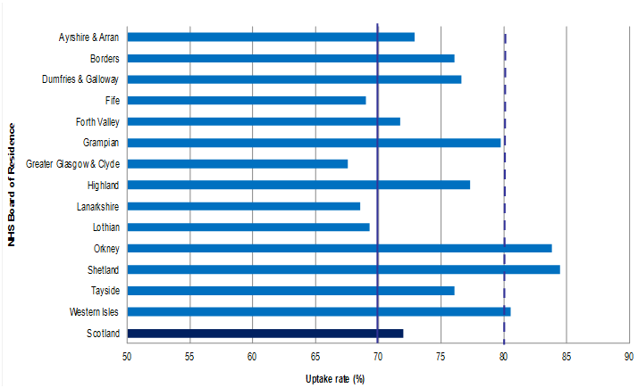

```{r, echo=FALSE, message=FALSE, warning=FALSE,error=FALSE}
NHSBoard <- c("AA", "BR", "DG", "FF", "FV", "GR", "GGC", "HG", "LN", "LO", "NWTC", "OR", "SH", "TY", "WI", "Scotland")

Q2Cases <- c(22, 2, 9, 9, 10, 16, 52, 9, 22, 44, 0, 1, 0, 24, 1, 221)

Q2BedDays <- c(72081, 21517, 27799, 49932, 47432, 84310, 232889, 43682, 91535, 150550, 6566, 2401, 2590, 72783, 4870, 910937)

Q2Rate <- c(30.5, 9.3, 32.4, 18.0, 21.1, 19.0, 22.3, 20.6, 24.0, 29.2, 0.0, 41.6, 0.0, 33.0, 20.5, 24.3)

Q3Cases <- c(19, 6, 4, 10, 10, 30, 79, 16, 24, 36, 0, 1, 0, 22, 0, 257)

Q3BedDays <- c(69082, 19603, 27097, 47691, 50473, 76321, 206241, 42439, 87927, 148176, 7091, 2194, 2257, 70267, 4632, 861491)

Q3Rate <- c(27.5, 30.6, 14.8, 21.0, 19.8, 39.3, 38.3, 37.7, 27.3, 24.3, 0.0, 45.6, 0.0, 31.3, 0.0, 29.8)

TableData <- data.frame(NHSBoard, Q2Cases, Q2BedDays, Q2Rate, Q3Cases, Q3BedDays, Q3Rate)
```

```{r, echo=FALSE, message=FALSE, warning=FALSE,error=FALSE}
FileName <- c("Performance standards", 
              "Performance standards (three-year rolling periods)",
              "Uptake by NHS Board",
              "Historical trends in Performance standards (three-year rolling periods)",
              "Historical trends in Uptake by NHS Board")
FileandSize <- c("Excel 500 Kb", "Excel 750 Kb", "Excel 750 Kb", "Excel 1.2 Mb", "Excel 1.2 Mb")

ListofTables <- data.frame(FileName, FileandSize)
```

```{r, echo=FALSE, message=FALSE, warning=FALSE,error=FALSE}
glossary1 <- c("Hendrerit", "Class aptent")
glossary2 <- c("Donec et metus sodales, aliquet ligula nec, bibendum leo.",
               "Nullam mi libero, hendrerit vitae condimentum in, iaculis porta purus. Suspendisse potenti. Donec sed molestie nisi, ut blandit ex. Proin tempor, mauris sit amet consectetur placerat, elit lorem placerat dui, sed placerat mi ante a purus.")

glossary <- data.frame(glossary1, glossary2)
```

#This is a National Statistics Publication

 \

\newline

National Statistics status means that the official statistics meet the highest standards of trustworthiness, quality and public value. They are identified by the quality mark shown above.
They comply with the Code of Practice for statistics and are awarded National Statistics status following an assessment by the UK Statistics Authority’s regulatory arm. The Authority considers whether the statistics meet the highest standards of Code compliance, including the value they add to public decisions and debate.

\newline

Find out more about the Code of Practice at:   
https://www.statisticsauthority.gov.uk/osr/code-of-practice/

\newline

Find out more about National Statistics at:  
https://www.statisticsauthority.gov.uk/national-statistician/types-of-official-statistics/ 

[pagebreak]

##Contents

\newline

```{r, echo = FALSE, results="asis"}
cat("1. Introduction",  
    "2. Main Points",  
    "3. Results and Commentary",  
    "    A) Sub-heading",  
    "    B) Sub-heading",  
    "4. Glossary", 
    "5. List of Tables", 
    "6. Contact", 
    "7. Further Information", 
    "8. Rate this publication", 
    "9. Appendices", 
    "    A) Appendix 1 – Background information", 
    "    B) Appendix 2 – Publication Metadata", 
    "    C) Appendix 3 – Early access details", 
    "    D) Appendix 4 – ISD and Official Statistics", 
    sep = "\n")
```

[pagebreak]

##Introduction

In tristique lobortis sagittis. Phasellus mollis mattis iaculis. Vivamus nunc justo, finibus nec maximus vel, ultricies vel urna. Ut ac mi sit amet augue fringilla egestas et ut mauris. Morbi volutpat, felis vel egestas scelerisque, nunc purus auctor ligula, non lobortis nulla felis in tortor. In nec commodo sem. Donec a dolor gravida, lobortis ligula vitae, pulvinar ante. Integer faucibus eros ut luctus tristique.
Proin vitae vehicula purus. Cras consequat iaculis venenatis. Morbi vel risus vestibulum, aliquet mi in, volutpat massa. Sed urna sem, posuere eu semper vitae, ullamcorper quis leo. Mauris nisi metus, scelerisque sed urna eu, maximus porttitor ante. Sed scelerisque accumsan commodo. Sed interdum justo volutpat, sodales nisi sed, consectetur arcu. Interdum et malesuada fames ac ante ipsum primis in faucibus. Donec sodales lacus in erat elementum viverra. Phasellus faucibus faucibus erat vitae pharetra. Mauris sed blandit dolor. Duis consequat fermentum diam quis elementum. Maecenas euismod non lorem sit amet ornare.
Praesent congue molestie nisi, ut congue dui mattis in. Vivamus vel urna risus. Donec sed blandit ex. Donec vel aliquam velit, in vestibulum lectus. Vivamus molestie massa in quam porttitor viverra. Nulla facilisi. Suspendisse fermentum metus justo, vel elementum ante rutrum eget.

[pagebreak]

##Main Points

* In tristique lobortis sagittis. Phasellus mollis mattis iaculis. Vivamus nunc justo, finibus nec maximus vel, ultricies vel urna. Ut ac mi sit amet augue fringilla egestas et ut mauris. Morbi volutpat, felis vel egestas scelerisque, nunc purus auctor ligula, non lobortis nulla felis in tortor. In nec commodo sem.
* Proin vitae vehicula purus. Cras consequat iaculis venenatis. Morbi vel risus vestibulum, aliquet mi in, volutpat massa. Sed urna sem, posuere eu semper vitae, ullamcorper quis leo. Mauris nisi metus, scelerisque sed urna eu, maximus porttitor ante. Sed scelerisque accumsan commodo. Sed interdum justo volutpat, sodales nisi sed, consectetur arcu. Interdum et malesuada fames ac ante ipsum primis in faucibus.
* Praesent congue molestie nisi, ut congue dui mattis in. Vivamus vel urna risus. Donec sed blandit ex. Donec vel aliquam velit, in vestibulum lectus.

[pagebreak]

##Results and Commentary
Suspendisse velit nisi, tempor ut posuere ut, blandit in mauris. Suspendisse commodo sagittis pretium. Nullam.

###Sub-heading
Suspendisse potenti. Donec sit amet porttitor urna. Fusce egestas et elit quis imperdiet. Quisque tempor, metus vel gravida fermentum, odio neque imperdiet justo, vitae sagittis turpis velit vitae velit. Nulla iaculis egestas tellus, non efficitur lorem molestie at. Donec urna sem, pharetra ut nunc non, tempor ullamcorper dolor. Duis fringilla mi eu erat lobortis, ac sagittis ipsum eleifend. Fusce eget rhoncus lorem.
Sed suscipit nisl vel orci scelerisque mattis. Proin ut tortor et purus bibendum pharetra vel elementum dolor. Morbi orci massa, egestas vel dictum quis, maximus id justo. Fusce eu sem consequat, mollis nulla in, mollis nisl. Lorem ipsum dolor sit amet, consectetur adipiscing elit. Morbi at facilisis augue.

####Table title
```{r, echo = FALSE, results='asis'}
knitr::kable(TableData)
```

####Figure 1: Uptake rate1 by NHS Board by three-year rolling period 2013-161,2,3,4
 \

1. Note one.  
2. Note two.  
3. Note three.  
4. Note four.  

###Sub-heading
Fusce hendrerit nibh sit amet tellus tincidunt vehicula. Class aptent taciti sociosqu ad litora torquent per conubia nostra, per inceptos himenaeos. Etiam non libero eu orci viverra rhoncus eu sed massa.
Mauris ac neque vel erat varius cursus. Praesent at molestie felis. Nunc eget ipsum non lectus facilisis dictum quis viverra magna. Pellentesque elementum condimentum accumsan. Nunc vel pharetra augue. Pellentesque vitae lectus cursus magna blandit aliquet. In aliquet sapien sit amet viverra aliquam.
Pellentesque aliquam imperdiet neque et interdum. Nulla sodales tellus magna, id venenatis justo pulvinar ut. Etiam luctus facilisis auctor. Curabitur interdum feugiat convallis. Nullam mi libero, hendrerit vitae condimentum in, iaculis porta purus. Suspendisse potenti. Donec sed molestie nisi, ut blandit ex. Proin tempor, mauris sit amet consectetur placerat, elit lorem placerat dui, sed placerat mi ante a purus.

[pagebreak]

####Figure 2: Trend in invasive cancer detection rate for Scotland
 \

Fusce hendrerit nibh sit amet tellus tincidunt vehicula. Class aptent taciti sociosqu ad litora torquent per conubia nostra, per inceptos himenaeos. Etiam non libero eu orci viverra rhoncus eu sed massa. Donec viverra scelerisque orci, sit amet dignissim eros ullamcorper rhoncus. Donec et metus sodales, aliquet ligula nec, bibendum leo. 

[pagebreak]

##Glossary
```{r, echo = FALSE}
    knitr::kable(glossary, col.names=NULL)
```

[pagebreak]

##List of Tables
```{r, echo = FALSE, results='asis'}
knitr::kable(ListofTables)
```

[pagebreak]

##Contact
**Name, title**  
Service  
Phone:  
Email:  
**Name, title**  
Service  
Phone:  
Email:  

##Further Information
Further Information can be found on the [ISD website](http://www.isdscotland.org/).  
For more information on XXX see the [XXX section of our website](http://www.isdscotland.org/). For related topics, please see the [XXX](http://www.isdscotland.org/) pages.  
The next release of this publication will be DD Month YYYY.  

##Rate this publication
Please [provide feedback](http://www.isdscotland.org/Health-Topics/HEALTHTOPIC/Publications/rate-this-publication.asp?ID=XXXX) on this publication to help us improve our services.

[pagebreak]

##Appendices
###Appendix 1 – Background information
Lorem ipsum dolor sit amet, consectetur adipiscing elit. Integer nec odio. Praesent libero. Sed cursus ante dapibus diam. Sed nisi. Nulla quis sem at nibh elementum imperdiet. Duis sagittis ipsum. Praesent mauris. Fusce nec tellus sed augue semper porta. Mauris massa. Vestibulum lacinia arcu eget nulla. Class aptent taciti sociosqu ad litora torquent per conubia nostra, per inceptos himenaeos. Curabitur sodales ligula in libero. 
Sed dignissim lacinia nunc. Curabitur tortor. Pellentesque nibh. Aenean quam. In scelerisque sem at dolor. Maecenas mattis. Sed convallis tristique sem. Proin ut ligula vel nunc egestas porttitor. Morbi lectus risus, iaculis vel, suscipit quis, luctus non, massa. Fusce ac turpis quis ligula lacinia aliquet. Mauris ipsum. Nulla metus metus, ullamcorper vel, tincidunt sed, euismod in, nibh. 
Quisque volutpat condimentum velit. Class aptent taciti sociosqu ad litora torquent per conubia nostra, per inceptos himenaeos. Nam nec ante. Sed lacinia, urna non tincidunt mattis, tortor neque adipiscing diam, a cursus ipsum ante quis turpis. Nulla facilisi. Ut fringilla. Suspendisse potenti. Nunc feugiat mi a tellus consequat imperdiet. Vestibulum sapien. Proin quam. Etiam ultrices. Suspendisse in justo eu magna luctus suscipit. Sed lectus. Integer euismod lacus luctus magna.

[pagebreak]

###Appendix 2 – Publication Metadata

[pagebreak]

###Appendix 3 – Early access details

\newline

**Pre-Release Access**  
Under terms of the "Pre-Release Access to Official Statistics (Scotland) Order 2008", ISD is obliged to publish information on those receiving Pre-Release Access ("Pre-Release Access" refers to statistics in their final form prior to publication). The standard maximum Pre-Release Access is five working days. Shown below are details of those receiving standard Pre-Release Access.

\newline

**Standard Pre-Release Access:**  
Scottish Government Health Department  
NHS Board Chief Executives  
NHS Board Communication leads  

\newline

**Early Access for Management Information**  
These statistics will also have been made available to those who needed access to ‘management information’, ie as part of the delivery of health and care:

\newline

**Early Access for Quality Assurance**  
These statistics will also have been made available to those who needed access to help quality assure the publication:

[pagebreak]

###Appendix 4 – ISD and Official Statistics

\newline

**About ISD**  
Scotland has some of the best health service data in the world combining high quality, consistency, national coverage and the ability to link data to allow patient based analysis and follow up.
Information Services Division (ISD) is a business operating unit of NHS National Services Scotland and has been in existence for over 40 years. We are an essential support service to NHSScotland and the Scottish Government and others, responsive to the needs of NHSScotland as the delivery of health and social care evolves.  
**Purpose**: To deliver effective national and specialist intelligence services to improve the health and wellbeing of people in Scotland.  
**Mission**: Better Information, Better Decisions, Better Health  
**Vision**: To be a valued partner in improving health and wellbeing in Scotland by providing a world class intelligence service.  

\newline

**Official Statistics**  
Information Services Division (ISD) is the principal and authoritative source of statistics on health and care services in Scotland. ISD is designated by legislation as a producer of ‘Official Statistics’. Our official statistics publications are produced to a high professional standard and comply with the Code of Practice for Official Statistics. The Code of Practice is produced and monitored by the UK Statistics Authority which is independent of Government. Under the Code of Practice, the format, content and timing of statistics publications are the responsibility of professional staff working within ISD. 
ISD’s statistical publications are currently classified as one of the following:  

* National Statistics (ie assessed by the UK Statistics Authority as complying with the Code of Practice)
* National Statistics (ie legacy, still to be assessed by the UK Statistics Authority)
* Official Statistics (ie still to be assessed by the UK Statistics Authority)
* other (not Official Statistics)  

Further information on ISD’s statistics, including compliance with the Code of Practice for Official Statistics, and on the UK Statistics Authority, is available on the [ISD website](http://www.isdscotland.org/About-ISD/About-Our-Statistics/). 


